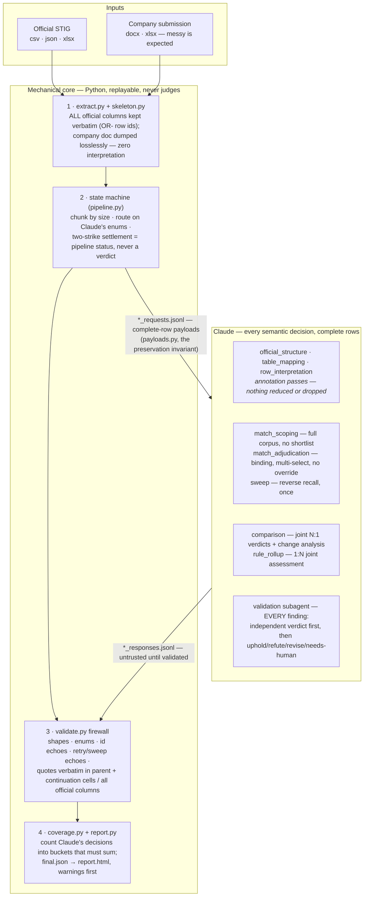
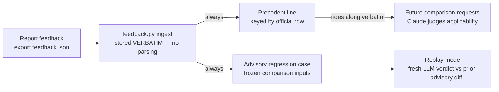

# stig-compare — End-to-End Workflow

> A Claude Code Skill that compares a company STIG submission (Word or Excel — messy tables, no STIG IDs required) against the official STIG rule set, and produces one self-contained HTML report built for human verification.

**At a glance:** 2 files in → 1 report out · Word / Excel / CSV / JSON · fully offline (no network, ever) · every claim traceable to source.

The design principle: **Claude makes every semantic decision — matching, comparison, verdicts, validation — over the complete rows of both documents; code parses, preserves, chunks, validates mechanically, counts, and renders. And nothing Claude says is trusted until it survives mechanical verification.**

---

## 1. The pipeline at a glance

Everything mechanical writes JSON artifacts to `runs/<run-id>/` and can be replayed. Claude sees COMPLETE rows on both sides in every pass — verbatim cells, continuation rows, headers, narrative, provenance on the company side; every column of every official row on the other — chunked only by size, never filtered by relevance. Every response crosses the **evidence firewall**: quotes must literally exist in the supplied evidence, ids must reference a real pending request, enums must be legal, retried answers must echo `retry: true`, and a response that fails twice is settled with a visible pipeline status.

---

## 2. What each stage does

1. **Extract & skeleton.** The official file is parsed losslessly: every row keeps ALL its columns verbatim (`cells` + `raw_record`), headers, sheet, row number, provenance, and a stable hashed `official_row_id` (`extract.py`). No header synonyms, no field reduction — which column means what is Claude's call. The company file is dumped losslessly into tables and rows (`skeleton.py`).
2. **Official-structure pass.** Claude annotates each official sheet: which column is the display ID, what role each column plays. Annotation only — nothing is dropped either way.
3. **Table-mapping pass.** Claude triages every company table — `stig_relevant`, `irrelevant`, or `uncertain` — and annotates columns with canonical-field roles. `irrelevant` is the only content-excluding decision, and it is Claude's.
4. **Row-interpretation pass.** Claude accounts for every row (`record`/`separator`/`continuation`), extracts canonical-field aids with cell-verbatim provenance, and reads each row's own compliance claim. The aids are ADDITIVE: the complete raw row travels to every later pass regardless.
5. **Match scoping.** Batches of complete company records are crossed with byte-budget slices of the COMPLETE official corpus; Claude nominates every plausible pairing. No scores, no thresholds, no shortlist — a record unmatched here is one Claude saw against every official row and declined.
6. **Match adjudication, then one reverse sweep.** Claude adjudicates each record against all its nominated rows — `match` (multi-select), `none`, or `ambiguous` — with verbatim quotes per selection. The decision is final; no code overrides it. A single reverse sweep then shows every still-unmatched record the complete still-unaddressed official rows; its proposals re-enter adjudication marked `sweep_round: true` (echo enforced).
7. **Comparison.** EVERY matched pair goes to Claude — one request per record covering its entire selected rule set, judged jointly. Output per rule: field-by-field alignment, semantic differences, change-analysis tags (`omitted`/`contradicted`/`weakened`/`strengthened`/`materially-changed`), a verdict from `Compliant | Deviating | Incomplete | Ambiguous | Cannot Assess`, Claude's own confidence and human-review flag, and record-level claim consistency. Prior reviewer feedback on the same official rows rides along verbatim as precedents; Claude judges applicability.
8. **Rule rollup.** For every official row matched by two or more records, Claude assesses whether the records JOINTLY satisfy the requirement (`fully-covered`/`partially-covered`/`conflicting`). Disagreement with a per-record verdict surfaces as a warning — it never overwrites.
9. **Validation.** EVERY finding — comparison and rollup alike — goes to an isolated validator subagent that receives the complete evidence AND the first pass's full reasoning, but must fix its own `independent_verdict` before reading the claim. Outcomes: `upheld`, `refuted` (finding shown as disputed), `revised` (effective verdict swaps, first-pass verdict preserved), `needs-human`. An uphold that contradicts the validator's own independent verdict is mechanically rejected.
10. **Coverage & report.** Coverage is pure arithmetic over Claude's decisions: every submission row lands in exactly one bucket — matched, ambiguous, unmatched, unresolved, ignored by an irrelevant table, separator, or extraction-failed — and the buckets must sum. Too much uncompared content triggers a red banner. The report shows the complete rows on both sides, the alignment table, all reasoning, and the validation outcome for every finding.

---

## 3. Why the results can be trusted

The tool is built to be *defensible*, not confident-looking:

| Mechanism | What it guarantees |
|---|---|
| **Complete-row evidence** | Every pass sees the full verbatim rows of both documents (`payloads.py` is the single source of truth). No Python heuristic ever pre-filters, reduces, or ranks what Claude may consider. |
| **Evidence firewall** | Claude cannot put anything into the report that isn't backed by quotes that literally exist in the two files — including continuation-row cells. Invented text, un-nominated row ids, and empty quotes are mechanically rejected. |
| **Unmatched beats mismatched** | `none` and `ambiguous` are always acceptable answers, the prompts prefer them to forced matches, and no code second-guesses either direction. |
| **Self-checking coverage** | Row accounting is arithmetic over Claude's own decisions and must balance. Unresolved and extraction-failed content is counted and displayed, with a red banner when too much wasn't compared. |
| **Independent validation of every finding** | A second, isolated pass re-derives every verdict — required to conclude before reading the claim, empowered to refute or revise, and mechanically caught if it rubber-stamps against its own conclusion. |
| **Full audit trail** | Every run stores its inputs' SHA-256 hashes, all component and prompt versions, every request/response pair, every validation failure, and every review reason — a future engineer can reconstruct exactly why a report said what it said. |

> **Confidentiality:** nothing leaves the machine. There are no network calls, no telemetry, no external services; logs carry counts and IDs, never document text. The report itself contains document content — that is its job — and is labeled sensitive.

---

## 4. How to use it

Three modes, all driven conversationally from Claude Code in this repository.
**Requirements:** Python 3.10+ with `openpyxl` and `python-docx` — nothing else, no internet.

### Mode 1 — Run a comparison

- **You say:** *"Use stig-compare to check `team_submission.docx` against `official_stig.csv`."*
- **What happens:** Claude runs the pipeline and answers every pass under the firewall — structure, mapping, interpretation, scoping (the big one: every record batch reads the whole official corpus), adjudication, sweep, comparison, rollup — then dispatches isolated validation subagents for every finding, and finalizes.
- **You get:** `runs/<timestamp>/report.html` — double-click to open in any browser; it works from disk, offline. Read it top-down: warnings, then the dashboard, then the findings flagged for review.

### Mode 2 — Give feedback on a finding

- **You do:** In the report, mark any finding — *correct, incorrect, wrong match, missed difference, not meaningful, wrong classification, other* — add a comment, and click **Export feedback**. A `feedback.json` downloads.
- **You say:** *"Ingest this feedback.json for run `runs/<timestamp>`."*
- **You get:** Every item stored verbatim (audit trail), a precedent keyed to its official row — future comparisons of that row carry your words verbatim and Claude judges whether they apply — and an advisory regression case.

### Mode 3 — Replay past feedback (maintainer, advisory)

- **You say:** *"Replay the stig-compare regression cases."*
- **What happens:** Each frozen case is re-answered through the current comparison prompt; the fresh verdict is diffed against the prior one and shown next to the reviewer's classification and comment, verbatim.
- **You get:** an advisory agreement report. Nothing is gated, auto-approved, or rewritten — disagreements are information for you.

---

## 5. The learning loop

Feedback never becomes a deterministic override: Python only stores and routes it by official-row key; whether a precedent applies to a new submission is always the comparing LLM's judgment, made in context, visible in its reasoning.

---

## 6. Honest limitations

- **Scoping cost is the price of completeness.** Every batch of ~8 records reads the entire official corpus in ~60KB slices — for a 300-rule STIG and a 100-row submission, roughly 150–250 scoping requests. No lexical pre-filter means no silent misses; it also means real token cost. Constants live in `scripts/schema.py`.
- **Severely malformed Word content stops at extraction.** Scanned images of tables or deeply nested layouts become visible *extraction-failed* items — counted against coverage, but not compared.
- **Semantic verdicts remain judgments.** Complete evidence, verbatim quotes, and an independent validation pass make them defensible, not infallible — which is exactly what the confidence field, the review reasons, and the disputed flag exist for.
- **An oversized joint comparison weakens jointness.** A record matching very many rules may be byte-split across comparison parts; the split is warned and the findings force human review.

---

*stig-compare v0.3.0 · LLM-semantic passes + mechanical firewall · every run stamps skill, extraction, pipeline and prompt versions into its report.*
