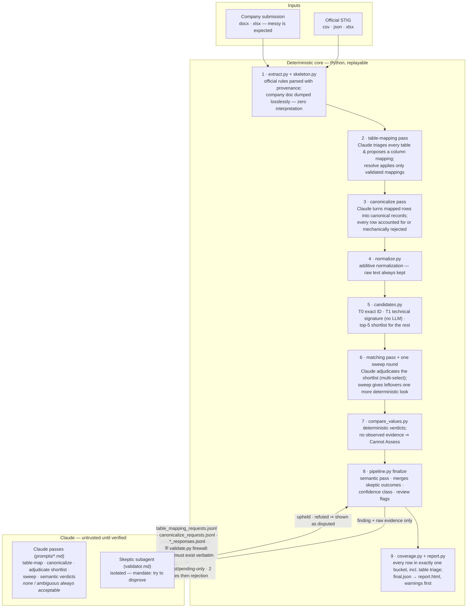
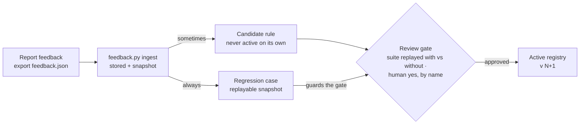

# stig-compare — End-to-End Workflow

> A Claude Code Skill that compares a company STIG submission (Word or Excel — messy tables, no STIG IDs required) against the official STIG rule set, and produces one self-contained HTML report built for human verification.

**At a glance:** 2 files in → 1 report out · Word / Excel / CSV / JSON · 130 automated tests · fully offline (no network, ever) · every claim traceable to source.

The design principle: **code does everything code can do reliably; Claude is used only where language must be interpreted — and nothing it says is trusted until it survives mechanical verification.**

---

## 1. The pipeline at a glance

Everything in the deterministic core writes JSON artifacts to `runs/<run-id>/` and can be replayed. Claude only ever sees narrow, pre-screened requests — and every response must cross the **evidence firewall**: quotes are checked to literally exist in the source documents, match answers may only reference the presented shortlist, and a response that fails twice is rejected with a visible audit entry. (The retired single-pass company extractor — `extract_company`, its `structuring_requests.jsonl`/`structuring_responses.jsonl`, and `prompts/structuring.md` — has been removed; company extraction now always goes through the table-mapping and canonicalize passes above.)

---

## 2. What each stage does

1. **Extract & skeleton.** The official file is parsed into rules with full provenance and stable hashed IDs (`extract.py`). The company file is dumped losslessly into tables and rows with zero interpretation (`skeleton.py`) — nothing is guessed, mapped, or dropped at this stage; that all happens in the two Claude passes below.
2. **Table-mapping pass.** Claude triages every table — `stig_relevant`, `irrelevant`, or `uncertain` — and proposes a column mapping (`table_mapping_requests.jsonl` / `table_mapping_responses.jsonl`). `resolve` applies only validated mappings; a table that fails validation twice is marked `mapping-failed` rather than guessed at.
3. **Canonicalize pass.** For every mapped table, Claude turns each row into one or more canonical records — or marks it a separator/continuation (`canonicalize_requests.jsonl` / `canonicalize_responses.jsonl`). Every row must be accounted for exactly once; a response that loses or duplicates a row is rejected mechanically.
4. **Normalize.** Whitespace, casing, Unicode and number formats are canonicalized for comparison — additively. The raw text is always preserved, so the report can distinguish a formatting-only difference from a real one.
5. **Match candidates.** An explicit STIG ID (rare) matches instantly (T0). A unique technical fingerprint — a command or parameter name like `password_reuse_max` — matches deterministically with no LLM involved (T1). Everything else gets a scored top-5 shortlist with the per-feature score breakdown preserved, so the report can show *why* a match was proposed. Group headings like "Password" are only a tie-breaker — never proof.
6. **Matching pass, then one sweep round.** Claude adjudicates the shortlist — multi-select, since one record can genuinely satisfy several rules — and `resolve` applies only validated answers (`matching_requests.jsonl` / `matching_responses.jsonl`). A single deterministic sweep (`sweep_requests.jsonl` / `sweep_responses.jsonl`) then gives anything still unmatched one more look against the still-unaddressed rules; its proposals feed back through the same matching adjudication, and the sweep itself never repeats.
7. **Deterministic verdicts.** Wherever both sides parse as values ("9" vs "9 or more", "60 days or less", enabled/disabled), code computes Compliant / Non-Compliant — Claude is not consulted. One rule is unoverridable: a record with no observed evidence is **Cannot Assess**, full stop.
8. **Finalize.** Everything code couldn't decide goes through a semantic pass (`semantic_requests.jsonl` / `semantic_responses.jsonl`), validated through the same firewall; an isolated skeptic subagent then tries to *disprove* each semantic finding. Refuted findings are shown as disputed with both positions — never dropped. Confidence is a class with criteria (High / Medium / Low), not a made-up score, and a separate flag marks anything needing human review.
9. **Coverage & report.** Coverage is pure arithmetic: every submission row lands in exactly one bucket — matched, ambiguous, unmatched, ignored by an irrelevant table, or extraction-failed — and the buckets must sum exactly. More than 10% not compared triggers a red banner. The report is one HTML file: run metadata with file hashes and component versions, warnings first (never collapsible), a verdict dashboard with a table-triage panel, side-by-side findings with verbatim quotes, and dedicated sections for the leftovers — ambiguous matches, unmatched rows, official rules nobody addressed.

---

## 3. Why the results can be trusted

The tool is built to be *defensible*, not confident-looking. Six mechanisms carry that:

| Mechanism | What it guarantees |
|---|---|
| **Evidence firewall** | Claude cannot put anything into the report that isn't backed by quotes that literally exist in the two files. Invented text, out-of-shortlist rule IDs and empty quotes are mechanically rejected. |
| **Unmatched beats mismatched** | The matcher never forces a link. Near-ties surface as ambiguous with both candidates shown; vague rows go to human review instead of being guessed. |
| **Cannot-Assess hard rule** | No observed value or evidence in the submission means Cannot Assess — deterministically. A match is never treated as proof of compliance. |
| **Self-checking coverage** | Row accounting is arithmetic that must balance. Extraction failures and skipped content are counted and displayed, with a red banner when too much wasn't compared. |
| **Built-in skeptic** | A second, isolated pass tries to break every semantic finding using only the raw evidence. Survivors keep their confidence; casualties are shown as disputed. |
| **Full audit trail** | Every run stores its inputs' SHA-256 hashes, all component and prompt versions, and every intermediate artifact — a future engineer can reconstruct exactly why a report said what it said. |

> **Confidentiality:** nothing leaves the machine. There are no network calls, no telemetry, no external services; logs carry counts and IDs, never document text. The report itself contains document content — that is its job — and is labeled sensitive.

---

## 4. How to use it

Three modes, all driven conversationally from Claude Code in this repository.
**Requirements:** Python 3.10+ with `openpyxl` and `python-docx` — nothing else, no internet.

### Mode 1 — Run a comparison

- **You say:** *"Use stig-compare to check `team_submission.docx` against `official_stig.csv`."*
- **What happens:** Claude runs the pipeline, answers the table-mapping / canonicalize / matching / sweep / semantic passes under the firewall, dispatches the skeptic, and finalizes. Anything it cannot resolve stays visible as pending or unmatched — never silently dropped.
- **You get:** `runs/<timestamp>/report.html` — double-click to open in any browser; it works from disk, offline. Read it top-down: warnings, then the dashboard, then the findings flagged for review.

### Mode 2 — Give feedback on a finding

- **You do:** In the report, mark any finding — *correct, incorrect, wrong match, missed difference, not meaningful, wrong classification, other* — add a comment, and click **Export feedback**. A `feedback.json` downloads.
- **You say:** *"Ingest this feedback.json for run `runs/<timestamp>`."*
- **You get:** Every item becomes a permanent regression test case. Qualifying corrections additionally draft a *candidate* rule — which is never active on its own.

### Mode 3 — Approve learned rules (maintainer)

- **You say:** *"Review pending stig-compare rules."*
- **What happens:** Each candidate is shown with the feedback that created it, and the full regression suite is replayed with and without the rule. A rule that fixes one case but breaks any previously-correct case **cannot be approved** — the gate is not skippable, even programmatically.
- **You get:** Only on your explicit yes (recorded with your name) does the rule go live, and the registry version bumps — so every future report can name exactly which rules influenced it.

---

## 5. The learning loop

The system improves from corrections without ever letting one person's feedback silently rewrite everyone's comparisons:

Feedback always strengthens the test suite; it only becomes an active rule after the regression replay proves it breaks nothing that previously worked, and a named human approves it. Rules are scoped (a field-level rule cannot leak into every comparison) and every finding records which rules touched it.

---

## 6. Honest limitations

- **A shortlist miss looks like "unmatched."** If the correct rule never enters the top-5, the row is reported unmatched rather than invented — visible, but still a false negative. The unaddressed-rules section is the safety net.
- **Severely malformed Word content stops at extraction.** Scanned images of tables or deeply nested layouts become visible *extraction-failed* items — counted against coverage, but not compared.
- **Semantic verdicts remain judgments.** Validated, quoted and skeptic-checked, but a paraphrase-equivalence call can still be wrong — which is exactly what the confidence class and review flag exist for.
- **The vocabulary needs one calibration pass.** Header synonyms and field aliases are seeded, not learned; the first run against a real team's file will tell us which to add.

---

*stig-compare v0.2.0 · deterministic pipeline + validated Claude passes · 130 tests · every run stamps skill, extraction, pipeline, prompt and rule-registry versions into its report.*
